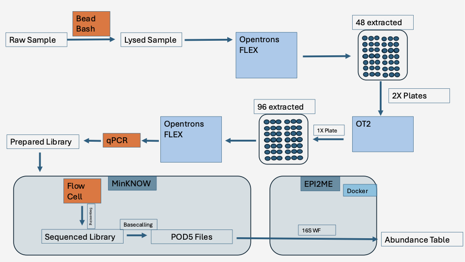

Lab Automation — Opentrons Protocol Suite (Portfolio)

Curated, sanitized Opentrons protocols for an end-to-end automation workflow supporting microbiome sample processing and library preparation.

## End-to-End 16S Workflow
The diagram below summarizes the full automation and sequencing workflow, highlighting platform responsibilities (Flex vs OT-2) and downstream data flow into 16S bioinformatics.

PDF version: [Download Flowchart](assets/16S_flowchart.pdf)

## What this repo demonstrates
- Production-style protocol organization for **OT-2** and **Opentrons Flex**
- Reusable helper functions and consistent configuration patterns (where applicable)
- Clear separation of protocol stages + run assumptions

## Technical Highlights
- Modular protocol organization by platform
- Parameterized volumes and deck configurations
- Reproducible plate mapping across runs
- Separation of automation logic from sequencing and analysis layers

### Impact
- Reduced manual handling variability across 16S library preparation workflows  
- Enabled scalable plate-based automation on OT-2 and Flex platforms  
- Structured outputs for downstream bioinformatics integration

## Repository structure
- `protocols/OT-2/` — OT-2 protocols
- `protocols/Flex/` — Flex protocols
- `docs/` — workflow overview, run instructions, redaction notes

## Workflow overview
High-level stages (typical):
1. Setup / reagent staging
2. Normalization / pooling
3. Library prep steps
4. Cleanup / QC handoffs + run logging

See `docs/workflow_overview.md`.

## Redaction / privacy
This repo omits any sensitive sample identifiers and internal operational details.  
See `docs/safety_and_redaction.md`.

## Attribution
Protocols were developed collaboratively in a lab environment; this repository is a portfolio mirror containing sanitized versions authored primarily by Tavis Goldwire.
